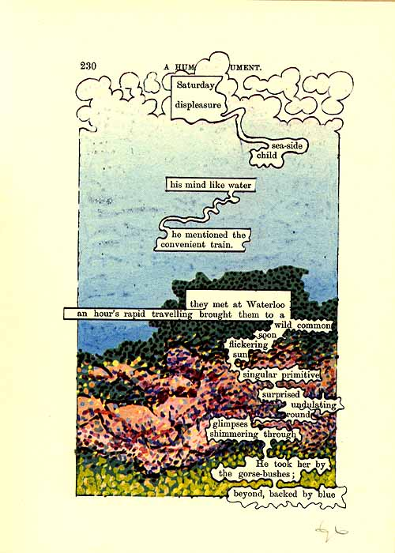
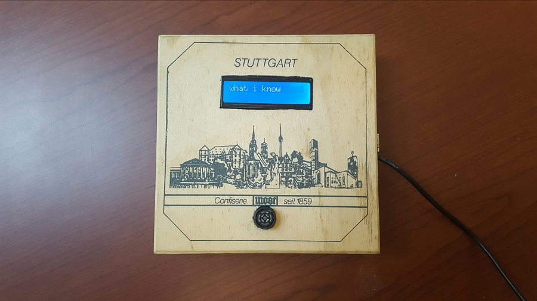
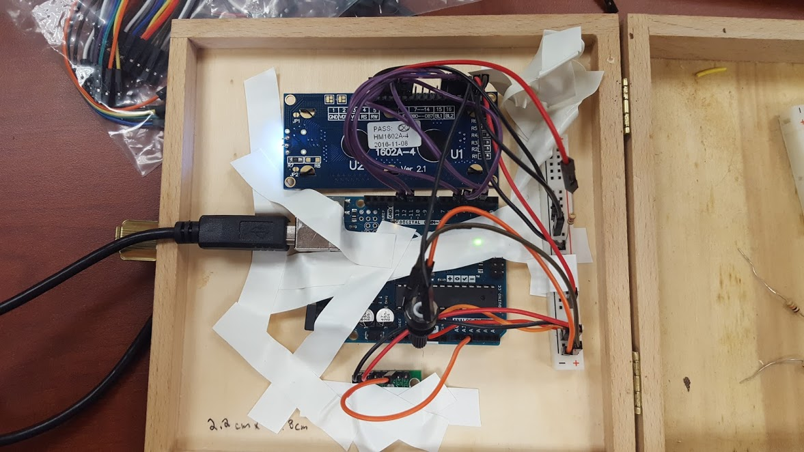

# Facts About Distance
## An Interactive Poem
##### Updated 4/18/2017

## Inspiration

### An erasure is a form of visual poetry in which a larger text is somehow "erased" in order to allow a sparser poem to emerge. Erasures often use found text and incorporate elements of visual art; one famous example of this is ["A Humument" by Tom Phillips](http://www.tomphillips.co.uk/humument). 

#### Recently, I learned that one of my former students, Desmond Crafton, passed away. Desmond was extremely young, only 21 years old. He was a brilliant poet and performer, and well after he finished school with me, he continued to be a force in the Chicago poetry community. I believed he was destined for great things as an artist. The suddenness of his loss was devastating, and created a strange, placeless grief for me. 

#### As a result of all this, the idea of erasure has taken on a new meaning to me. Over the past several weeks, I have been creating different artistic works that approach the idea of erasure and memory. In so doing, I believe a new concept of erasure can be achieved by combining physical computing concepts with interactive poetry. 

## Concept

#### My execution of this project continues to evolve, as I believe my final project is part of a larger series in development inpired by Desmond. But I've conceptualized this project as an interactive poem-object, which involves these basic components:

#### -An Arduino Uno
#### -A corresponding code 
#### -A max sonar sensor
#### -A Liquid Crystal Display screen 
#### -An original elegiac verse composed for the project

These components are installed within a found box (visual elements of which are referenced in the poem's text).

### Facts About Distance

##### what i know

#### is yesterday

#### in stuttgart

#### there were clouds

#### you were one 

#### night's distance

#### my calendar

#### each dark hour

#### widens an age

#### since you

## Composition 

#### In writing this poem, I have used short lines, no more than 16 characters each, so that they can fit on the narrow LCD screen. 

#### The code uses an if/else loop to read sensor data and trigger different lines of text. However, I am continuing to develop this aspect of the project for a gallery setting, where there might be multiple viewers at once. 
#### The current challenge is [revisiting the sonar sensor data](http://www.maxbotix.com/documents/LV-MaxSonar-EZ_Datasheet.pdf), to decipher the different ways it measures distance, and therefore which variables may trigger a line. I am contemplating using a different loop other than if/else that may have a less sensitive execution. 

## Installation 

#### Installation of the components has been the most difficult part of creating this project. A lot of wires are involved in making an LCD screen work, which is fine, but has become complicated because all of the components are installed in a single surface. 

#### I have chosen to install the Arduino Uno on the same surface as the other components, because installing it on the opposite side requires longer wires (so that the box may open/close), which proved to take up too much space. 

#### Additionally, I have chosen not to solder wires, because after numerous attempts at soldering, I found it did not save much space, and was more fragile. Instead, I'm using male/female headers. 

#### As you can see in the picture above, I've temporarily installed these components with electrical tape. I am designing simple parts using [OnShape.com](https://www.onshape.com/), which will be 3D printed. Those parts will span across the components & be glued in place. I've chosen to do this rather than screwing in components for two reasons - 1) most importantly, so that the screws are not visible from the other side of project, 2) because the wood of the box is very brittle, and might break easily under more pressure. 

## Going Forward

#### As of 4/18/17, these are the tasks that remain to complete this project:

#### -Design & print 3D parts for installation
#### -Revisit max sonar data for a gallery setting
#### -Edit code to more efficiently use sonar data

#### The final project is due 5/4/17. 