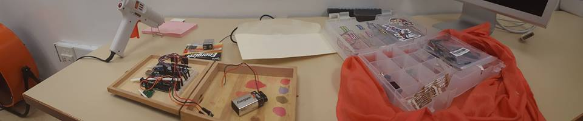

# Facts About Distance
## An Interactive Poem

##### Most Recent Update: 5/3/2017

## 4/18/2017 

## Inspiration

### An erasure is a form of visual poetry in which a larger text is somehow "erased" in order to allow a sparser poem to emerge. Erasures often use found text and incorporate elements of visual art; one famous example of this is ["A Humument" by Tom Phillips](http://www.tomphillips.co.uk/humument). 

### What if an erasure was inverted, so that text was not erased, but emergent? What would its destination be? How can the experience of emerging be translated to text? In "Facts About Distance," these questions are ones I've applied to my work as a poet and interactive media artist in an attempt to create an original art form and tribute. 

#### Recently, I learned that one of my former students, Desmond Crafton, passed away. Desmond was extremely young, only 21 years old. He was a brilliant poet and performer, and well after he finished school with me, he continued to be a force in the Chicago poetry community. I believed he was destined for great things as an artist. The suddenness of his loss was devastating, and created a strange, placeless grief for me. 

#### As a result of all this, the idea of erasure has taken on a new meaning to me. Over the past several weeks, I have been creating different artistic works that approach the idea of erasure and memory. In so doing, I believe a new concept of erasure can be achieved by combining physical computing concepts with interactive poetry. 

## Concept

#### My execution of this project continues to evolve, as I believe my final project is part of a larger series in development inpired by Desmond. But I've conceptualized this project as an interactive poem-object, which involves these basic components:

#### -An Arduino Uno
#### -A corresponding code 
#### -A max sonar sensor
#### -A Liquid Crystal Display screen 
#### -An original elegiac verse composed for the project

These components are installed within a found box (visual elements of which are referenced in the poem's text).

## Composition 

#### In writing this poem, I have used short lines, no more than 16 characters each, so that they can fit on the narrow LCD screen. 

### Facts About Distance

##### what i know

#### is yesterday

#### in stuttgart

#### there were clouds

#### you were one 

#### night's distance

#### my calendar

#### each dark hour

#### widens an age

#### since you

## Code

#### The code uses an if/else loop to read sensor data and trigger different lines of text. However, I am continuing to develop this aspect of the project for a gallery setting, where there might be multiple viewers at once. 

#### The current challenge is [revisiting the sonar sensor data](http://www.maxbotix.com/documents/LV-MaxSonar-EZ_Datasheet.pdf), to decipher the different ways it measures distance, and therefore which variables may trigger a line. I am contemplating using a different loop other than if/else that may have a less sensitive execution. 

## Hardware

#### Installation of the components has been the most difficult part of creating this project. A lot of wires are involved in making an LCD screen work, which is fine, but has become complicated because all of the components are installed in a single surface. 

#### I have chosen to install the Arduino Uno on the same surface as the other components, because installing it on the opposite side requires longer wires (so that the box may open/close), which proved to take up too much space. 

#### Additionally, I have chosen not to solder wires, because after numerous attempts at soldering, I found it did not save much space, and was more fragile. Instead, I'm using male/female headers. 

#### As you can see in the picture above, I've temporarily installed these components with electrical tape. I am designing simple parts using [OnShape.com](https://www.onshape.com/), which will be 3D printed. Those parts will span across the components & be glued in place. I've chosen to do this rather than screwing in components for two reasons - 1) most importantly, so that the screws are not visible from the other side of project, 2) because the wood of the box is very brittle, and might break easily under more pressure. 

## Going Forward

#### As of 4/18/17, these are the tasks that remain to complete this project:

#### -Design & print 3D parts for installation
#### -Revisit max sonar data for a gallery setting
#### -Edit code to more efficiently use sonar data

#### The final project is due 5/4/17. 

## Update 5/3/2017

##The project is completed! 

#### [Here is a link to the final code for this project.](https://github.com/wirginiavoolf/physical-computing/blob/master/final/scrollmodinteractive/scrollmodinteractive.ino) I've learned a lot in the past two weeks. 

## Revision Process

### Code 

#### In the previous version of the code, I used a long if/else loop where different lines of the poem would be triggered by different distances. Although a nifty concept, I could not get it to work. I assumed this is because of the maxsonar sensor (more on that later). But after reflecting, I realized that it was not a very user friendly approach anyway.

#### Because of this, I decided to use only an "if" & an "if else" statement. In the priliminary "if" statement, the title of the project & a line of instruction ("to begin, get close") are displayed. When a user leans over the project, the poem event begins -- the lines of the poem are displayed in sequence. I added a "return" function at the end of the code so that the project will start over (it will only start over if the user becomes distant). I've used if/else loops many times in the past year, but never used "return" before, so that was fun to learn. I think I could have also used a "while" loop to achieve the same effect, but I did not do this.

#### I used the [Scroll Mod code](
 http://www.arduino.cc/en/Tutorial/LiquidCrystalAutoscroll) for the LCD screen as a starting point. 

 ### Hardware 

 #### I wired a 9 volt battery as a power supply for the project. I used the battery snap that comes with the Arduino starter kit. I wired it into my tiny bread board. 9 volts is too much power for the screen, so I used resistors to bring it down (according to [this site](http://www.camradio.net/resistors.html), they're  "10 MEG ohms    and   5 % tolerance" resistors). If I had a little more time, money, and equipment, I would have done a different battery set-up and used AAA batteries, but I did not have those things, and this set-up works fine. 

 #### Sidenote: there's a lot of scary stuff out there in the Googles about using a 9 volt battery with Arduino. For my purposes, which is to display this object for a few hours in a gallery show, this is fine. If the project needed to run continuously for days, I would definitely need to use different batteries, and also have a power switch. 

 #### Using OnShape.com, I designed and 3D printed some parts for holding the components in place. I hot glued those into the box. I designed the parts a little too shallowly, but with lots of hot glue, it ended up working out. 

 #### Finally, I decided to paint the box with watercolors to make it a little more exciting. 

  #### In terms of challenges: I did not end up figuring out more about the way the maxsonar sensor reads code because I had a few hardware issues. At some point, I had wired the sensor backwards (somehow it was still working, albeit erratically). That was a real easy fix! 

 #### However, after that, I ran a few codes, and realized that the sensor was being interferred with due to environmental factors related to its electrical current. It seems to work more consistently when running on a battery than when connected with a USB. I'm not 100% sure what causes this, but it might be from the physical cord resting against the same surface as the sensor. For the purpose of a gallery exhibit, I removed a line of code that stabilizes the sensor read to make it more sensitive; the downside of this is that the interactivity is a little less reliable, but the upside is that a user will be able to experience the complete poetry event. 

 ### The End 

 #### I hope that this documentation might be useful to others out there. I'm a poet, not a rocket scientist (h/t to the Arduino Projects Book). I love integrating technology and code into art, but I've struggled a lot to learn jargon and logic. I'm very fortunate to have had the opportunity to take university courses on this stuff, and especially to work with Zeven Rodrgiuez. I may have given up on some of these challenges without such a valuable resource. But I didn't get up. I cried a little, executed complex Google searches, and read that stupid maxsonar PDF front and back more times than I'd like to admit, and I made a weird little microcomputer project. 

 #### A lot of times, I thought what I was doing was the opposite of a poem. Poems don't have rules. Whether they work or not is subjective. And numbers only ever come up if you're writing a sonnet. But in the end, I hope I made something meaningful. 

 ###And Desmond, wherever he is now -- I hope that, in some way, this little object can honor him. It will be the first of many. 