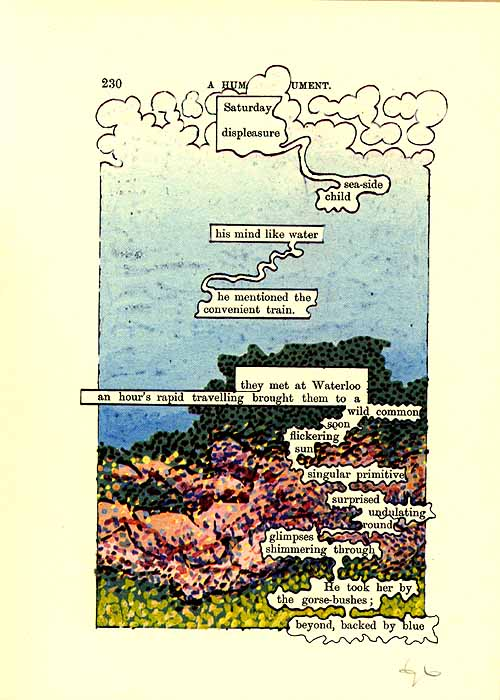

#Digital Erasures
##An Interactive Poem

###An erasure is a form of visual poetry in which a larger text is somehow "erased" in order to allow a sparser poem to emerge. Erasures often use found text and incorporate elements of visual art; one famous example of this is ["A Humument" by Tom Phillips](http://www.tomphillips.co.uk/humument). 

####Recently, I learned that one of my former students, Desmond Crafton, passed away. Desmond was extremely young, only 21 years old. He was a brilliant poet and performer, and well after he finished school with me, he continued to be a force in the Chicago poetry community. I believed he was destined for great things as an artist. The suddenness of his loss was devastating, and created a strange, placeless grief for me. 

####After I learned of his death, I reread a portfolio of work he had sent me a few years ago. I am inspired by his work, and feel a strong desire for his legacy to continue. As a poet mourning the loss of another, I turned to our shared craft to memorialize him. As such, I've been developing a long poem that utitlizes an original poem by Desmond, a poem I've written in response, and an erasure of the two. 

####In working on this poem, I've realized that it can achieve its highest formal potential not as a page-bound literary work, but as an interactive poem intended for a gallery space. Ultimately, this poem will use a 2 projections of a canvas containing text (one of Desmond's poem, the other of my response). Using sonar sensors, as a viewer approaches the canvas, fragments of the text will fade to white, leaving only the erasure. My intention is to create a visual experience of grief as a result of death, the experience of our relationships with the deceased fading only to fragments of memory. 

##A Partial Erasure 

###My midterm project will be developed in support of this final vision. As such, I will be attempting a smaller-scale version of what I've proposed above in an effort to perfect the code and gathering of input data from the hardware. 

###What I am prosposing will involve:

##-2 versions of a single line of text: the full version & the erasure
##-the use of a sonar input that creates a "fading" effect on a part of the text

##The goal will be figuring out how I can properly "slice" a text so that some parts of it fade while the others remain the same. 