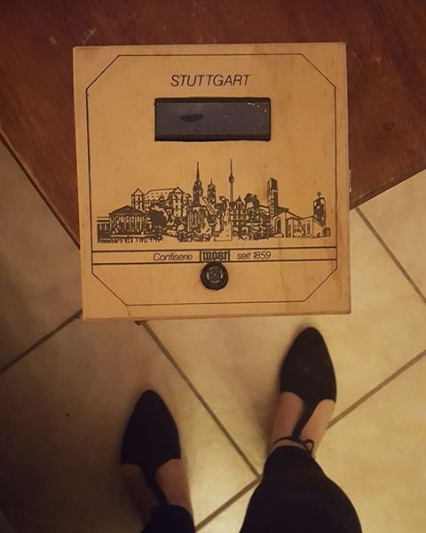

#Using a Max Sonar Sensor w/ an LCD Screen
##An Interactive Poetry Project
#####Updated 4/5/2017

###In poetry, a contrapuntal is a form where a poem is written in columns, and can be read both horizontally or vertically. Using a max sonar sensor and an LCD screen, I have created an interactive contrapuntal within an art object. As the user approaches the art object, different parts of the poem will display. 

####Initially, I developed this project for a midterm assignment in my physical computing course. I initially had planned to have the sonar interact with a browser to display text. I decided to use an LCD screen instead, since this would allow me to create a self-contained object, and bypass creating an ethernet connection. (I do plan to execute my original idea later on.)

###Parts

####-Max Sonar Sensor
####-LCD Screen
####-Arduino Uno
####-Wooden confectioners box. 
####-Wires of various length

####The parts are installed inside of the box. 

###Code

####The code of the project uses an if/else statement; when a user comes within a range of distance, the text on the LCD screen changes. [The code can be found here.](https://github.com/wirginiavoolf/physical-computing/blob/master/midterm/midterm/midterm.ino) Important to note that this project uses the [LiquidCrystal.h library](https://www.arduino.cc/en/Reference/LiquidCrystal). 

####I plan on continuing to develop this loop to interact with more points of distance, so that the poem progresses as it is approached, rather than there being one singular event. 

###Process

####Out of any coding project I've ever undertaken, this one has had the most set backs. 

####First and foremost, most of the LCD wiring set-ups I found, both within the Aruduino starter kit project book & online, require a petentiometer to work. Mine would not work with the pententiometer. Even if it could work, it was much easier, logistically, to wire the screen without it. I used a wiring guide from [Ictronic](https://ictronic.wordpress.com/2016/07/02/interfacing-16x2-lcd-with-arduino-without-potentiometer/). (I also built my LCD code off of their example.)

####I also struggled with figuring out how to read the input data from the Max Sonar sensor; I found tons of code on how to translate this data into cm & inches, but even after reading the [data sheet](http://www.maxbotix.com/documents/LV-MaxSonar-EZ_Datasheet.pdf), it's unclear to me what the random numbers the sensor reads actually means. It will be more important for me to have a better understanding of this data if I add more interactivity to the loop. 

####Wiring of the sensor was much easier; since the LCD screen uses digital pins, I used its analog pin. The sensor pins are clearly labeled and straight forward; [this guide explains what they mean. ](https://blog.adafruit.com/2009/06/23/getting-started-with-the-maxbotix-sonar-sensor-quick-start-guide/)

####I was able to get my project to work on the bread board -- I will be inserting a video here of what that looks like. 

####The greatest challenge by far has been installing this project into the box. I used a wooden confectioner's box that I found at the thrift store. It looks very pretty, and inspired me a lot: 

####However, I epically failed at my first attempt of soldering wires to a header for the LCD screen. Beyond my novice skills, I had problems keeping solder from accidentally fusing to neighboring wires. Also, when I did finally get all wires soldered, the box was too crowded, and wires snapped off. 

####I've ultimately abandoned the idea of soldering and ordered some [male/female jumper wires](https://www.adafruit.com/?q=male%20female%20wires&). If I could go back in time to when this project began, I would have ordered these much sooner -- whether or not the wires are soldered will make no difference to a viewer, and would have saved me hours of grief and failure. 

###Conclusion

####This project is still in development as I expand on my original idea and address its shortcomings. 